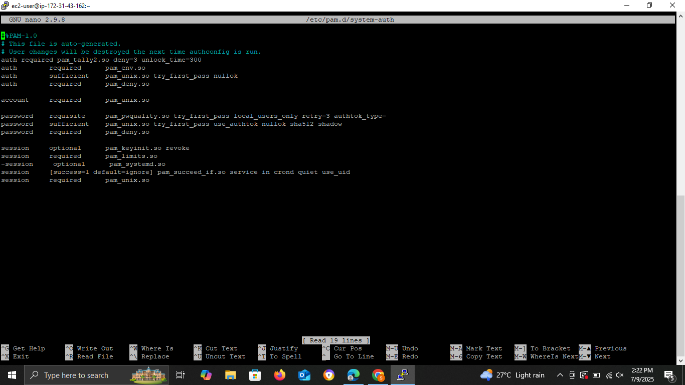
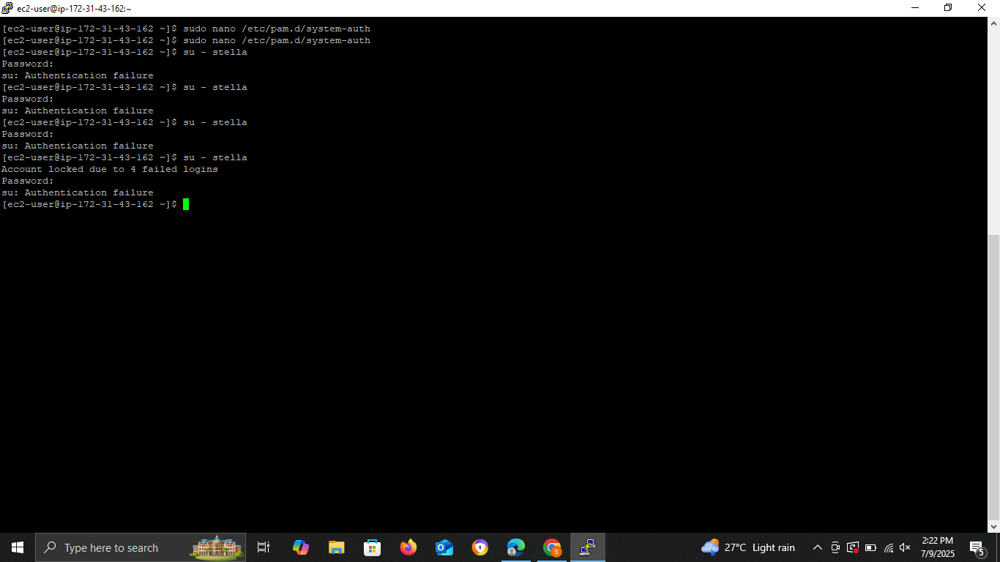

# Documentation Guide for Configuring Password Policies on an EC2 Linux AWS Instance
Welcome to the Cloud Security Lab Project to demonstrate the configuration of password policies on an EC2 Linux AWS Instance using a Windows PC.

This repository contains a step-by-step guide to configuring a secure password policy on a Linux instance hosted on AWS.

## Project Overview
Password policies define rules that enhance the strength and effectiveness of user authentication. They help protect systems from brute force attacks, unauthorized access, and insider threats by ensuring that only secure, non-trivial passwords are accepted.

In today's digital age, password security is a critical aspect of protecting sensitive information and systems. A well-defined password policy is essential for ensuring the security and integrity of Linux instances on AWS. This guide provides a comprehensive overview of configuring password policies on Linux AWS instances, highlighting best practices and step-by-step instructions for implementation.

## Best Practices for Password Policies
Implementing effective password policies on Linux systems, especially those running on AWS is a foundational security control. These best practices help protect against unauthorized access, brute-force attacks, and credential compromise.

### 1. Enforce Strong Passwords
Require users to include uppercase and lowercase letters, numbers, and special characters in their passwords.

Simple passwords like password123 are vulnerable to brute-force and dictionary attacks. Requiring complexity significantly increases the time and computing power needed to crack a password.

### 2. Set Minimum Password Length
Enforce a minimum length of 12 characters or more.

A longer password dramatically increases the number of possible combinations, making it exponentially harder to crack. For example, an 8-character password can often be brute-forced in minutes, while a 12-character password could take years.

### 3. Implement Password Expiration
Require password changes every 60–90 days, depending on organizational policy.
Regular password changes limit the duration of exposure in case a password is compromised. It also encourages users to adopt a proactive security mindset.

### 4. Enforce Password History
Prevent users from reusing their last 5–10 passwords.
Without history enforcement, users often recycle the same few passwords. This defeats the purpose of periodic changes and increases the risk of credential reuse across systems.

### 5. Configure Account Lockout Thresholds
Lock accounts after 3–5 failed login attempts, with a cooldown or admin unlock required.
This helps mitigate brute-force attacks by limiting how often an attacker can attempt guesses. It also provides an early warning of potential intrusion attempts.

## Tools & Technologies Used in This Guide
### 1. AWS EC2 Instance
- **Description:** Amazon Elastic Compute Cloud provides resizable compute capacity in the cloud. This gives us the Linux environment we need.
- **Purpose:** Hosts the Linux virtual machine where password policy configuration is demonstrated.

### 2. PuTTYgen
- **Description:** A key generator tool used to convert OpenSSH .pem files to PuTTY .ppk format.
- **Purpose:** Converts the AWS-provided `.pem` private key into `.ppk`, required by PuTTY on Windows.

### 3. PuTTY
- **Description:** A free and open-source terminal emulator for Windows that supports SSH.
- **Purpose:** Used to securely connect to the EC2 Linux instance from a Windows computer using the `.ppk` key.

# Step-by-Step Guide: Implementing Password Policy on a Linux AWS Instance
This guide provides a detailed walkthrough on how to set up a Linux EC2 instance on AWS and implement password policy configurations for better system security.

## Step 1: Launch a Linux EC2 Instance
- Go to [AWS Console](https://aws.amazon.com/console/) and sign in as the **root user** or create an account.
- In the AWS Management Console:
   * Search for **"EC2"** and click to open the EC2 dashboard.
   * Click on **"Launch an Instance"**.
- Configure the instance:

   * **Name**: `Linux-Password-Policy` (example used in this demonstration)
   * **AMI**: Select `Amazon Linux 2 AMI (HVM) - Kernel 5.10, SSD Volume Type`
   * **Instance Type**: Choose `t3.micro` (default eligible for Free Tier)
- Under **Key pair (login)**:

   * Click **"Create a new key pair"**
   * **Name**: `PolicyKey` (example used in this demonstration)
   * **Key pair type**: `RSA`
   * **Private key format**: `.pem`
   * Click **"Create key pair"** to download the `.pem` file.
- **Network settings**: Leave as default.
- **Storage**: Use default — 1 x 8 GiB `gp2`
- Click **"Launch Instance"**

## Step 2: Connect to the Instance
### Get the Public IP
* In your EC2 dashboard, go to **Instances**
* Copy your instance’s **Public IPv4 address**

### Install PuTTY (if not installed)
* Download [PuTTY Installer](https://www.putty.org/)
* It includes **PuTTY** and **PuTTYgen**

### Convert `.pem` to `.ppk` using PuTTYgen
   - Open your file explorer > Downloads
   - open the `.pem` key file you downloaded using PuTTYgen (PuTTYgen comes with PuTTY when you install it)
   - click on save private key, and exit.

   * Confirm saving without a passphrase
This generates a `.ppk` file you’ll use to authenticate with PuTTY

### Connect with PuTTY

- Open **PuTTY**
- Under **Session**:
    * In **Host Name (or IP address)**, paste your **Public IPv4**
- In the left panel, expand:
     * `Connection` → `SSH` → `Auth`
     * Under **"Private key file for authentication"**, click **Browse** and select your `.ppk` file
- Click **Open** to start the session
   * click on open and select connect once when prompted with security alert
- Login as:
   ```bash
   ec2-user
   ```

## Step 3: Password Policy Settings
Type the command 
```
sudo nano /etc/security/pwquality.conf
```
to open the password quality configuration file in the nano text editor.


Once you're inside the `/etc/security/pwquality.conf` file, you’ll find several settings (some lines may start with `#`, meaning they’re just comments). These settings define what makes a password strong or weak on your Linux system.
```
- Use the up and down arrow keys to navigate to the parameter you want to edit.
- Use the right and left arrow keys to move the cursor within the line.
- Modify the value of the parameter as desired.
```

Below are the settings explained 

### 1. `difok = 5`
Requires at least **5 characters** in your new password to be different from your old password.

Prevents users from choosing new passwords that are too similar to their old ones (like changing `Password123!` to `Password124!`).

### 2. `minlen = 12`
Sets the **minimum password length** to 12 characters.
Longer passwords are more secure. Anything shorter than 8 is considered weak today.

> You cannot set this below 6.

### 3. `dcredit = -1`
Requires **at least 1 digit** (0–9) in the password.
Digits add complexity and make passwords harder to guess.

> `-1` means it **must** have a digit.
> Positive numbers (e.g. `1`) make digits **optional**.

### 4. `ucredit = -1`
Requires **at least 1 uppercase letter** (A–Z).
Uppercase letters add diversity to your password, increasing security.

### 5. `lcredit = -1`
Requires **at least 1 lowercase letter** (a–z).
A password made of all uppercase or just numbers is weaker without lowercase letters.

### 6. `ocredit = -1`
Requires **at least 1 special character** (like `!`, `@`, `#`, `$`, etc.)
Symbols make passwords harder to guess or brute-force.

> `0` = no character repetition allowed. To allow repetition, set to a higher number (e.g. `3` = max 3 repeated characters allowed)

### Save and Exit the File
Once you’ve made your changes in the nano editor (for example, updating values like minlen, dcredit, etc.), you need to save and exit the file.

Follow these steps:
```
Ctrl + O   → Save (Write Out) the file  
Enter      → Confirm the filename (just press Enter)  
Ctrl + X   → Exit the nano editor
```
Tip:
Nano shows these shortcuts at the bottom of the editor. The ^ symbol means "Ctrl".
So ^O = Ctrl + O, and so on.

### Testing the Password Policy
Now that you've configured your password rules, it’s important to verify that everything works correctly. We’ll test it by creating a new user and trying to assign different types of passwords.


### Create a Test User
Run the command below to create a new user for testing:
```
sudo adduser demouser
```

### Try Setting a Weak Password
Now try setting a weak password that doesn’t meet your policy:
```
sudo passwd demouser
```
When prompted, enter a weak password like:
```
demo123
```
> Note, when typing in password it doesn't show but don't worry the input is happening.
Expected result:
You should see a message like:
```
BAD PASSWORD: it is too short
```
This means your password policy is working,the system is rejecting weak passwords.

### Try Setting a Strong Password
Now enter a password that meets all your policy rules.
```
sudo passwd demouser
```
Example: SecurePass2025!
Expected result:
The password should be accepted successfully

## Step 4: Set Account Lockout Threshold (Failed Login Attempts)
To enhance your system's security, we'll set up login attempt limits using PAM (Pluggable Authentication Modules). This helps block brute-force attacks by temporarily locking users out after multiple failed login attempts.
### Importance of Login Attempt Limits
- Prevents brute-force attacks by limiting the number of login attempts
- Reduces the risk of unauthorized access to your system
- Protects against dictionary attacks and password guessing

This configuration is usually done in the PAM (Pluggable Authentication Module) configuration files, located in /etc/pam.d/.

## Step-by-step

1. Open the PAM configuration file:
```bash
sudo nano /etc/pam.d/system-auth
```
2. At the **top of the `auth` section**, add the following line:
```bash
auth required pam_tally2.so deny=3 unlock_time=300
```
**What this does:**
* `deny=3` → Locks account after **3 failed attempts**
* `unlock_time=300` → Unlocks after **5 minutes (300 seconds)**
> You can adjust the values:
>
> * Increase `deny` to allow more tries (e.g. `deny=5`)
> * Change `unlock_time` for longer or shorter lockout periods

3. Save and exit the file:
```text
Ctrl + O → Save  
Enter    → Confirm  
Ctrl + X → Exit
```
## Test the threshold configuration

* Try logging in with the **wrong password 3 times** (using the test user).
* The user account will be **temporarily locked**.
* Wait 5 minutes (or the time you set with `unlock_time`) — the account will unlock automatically.


